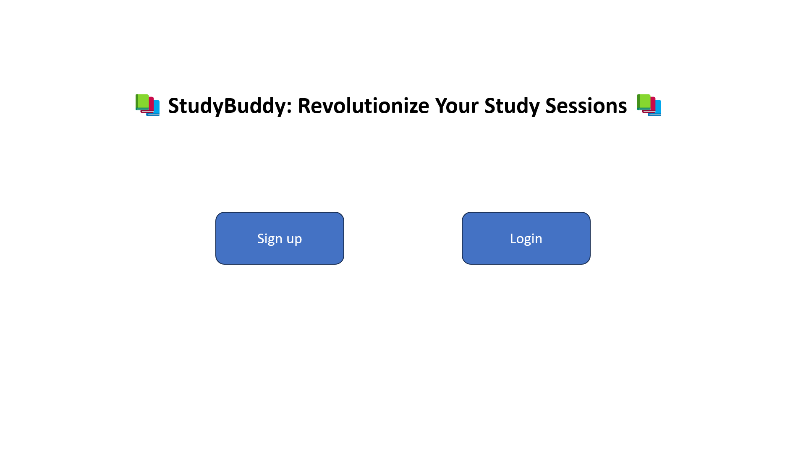
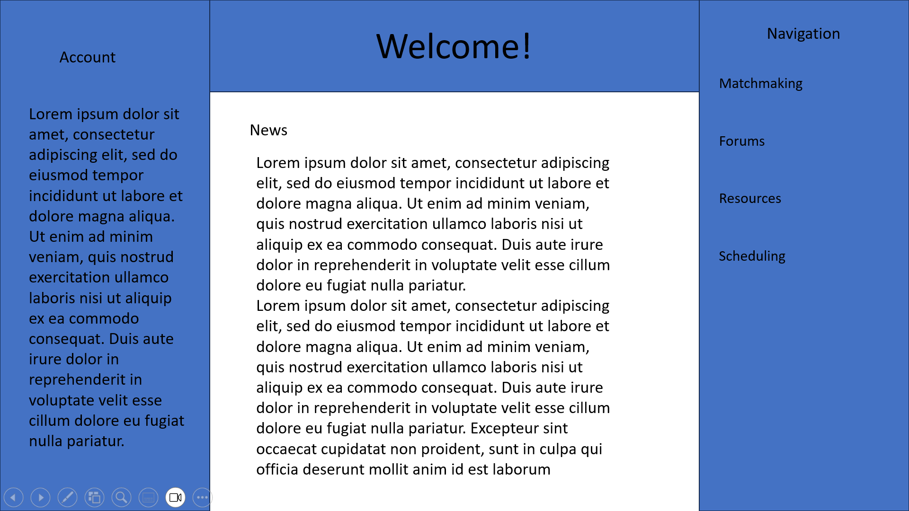

# 📚 StudyBuddy: Revolutionize Your Study Sessions 📚

Welcome to the StudyBuddy startup repository! We're dedicated to enhancing the college study experience by harnessing the power of community learning.

# 🚀 Elevator Pitch
Ever felt the pressure of an upcoming exam and wished you had a group to study with? StudyBuddy connects you with fellow students who share the same class schedule and study needs. Match, connect, and ace your exams together!

# 🔑 Key Features:
1. Instant Matchmaking - Input your subjects and available study times to find the perfect study partner or group.
2. Subject-Based Forums - Have a question about a tricky topic? Ask away and let the community help.
3. Study Resources - Share or access crowd-sourced notes, flashcards, and study guides.
4. Scheduling - Easily schedule and manage your study sessions with an in-built calendar.

# 💻 Technology Stack:
1. HTML, CSS, and JavaScript - The backbone of our web application, ensuring a responsive and interactive user interface.
2. AWS EC2 - Hosting our web servers and backend processes. Ensures that our application is scalable and can handle multiple users simultaneously.
3. AWS Route 53 - Manages our domain name system (DNS) and routes user requests to the appropriate infrastructure.
4. TLS - Ensuring all data transactions between users and the server remain encrypted and secure.

# 🎨 Design Mockups:

Below you'll find the initial design sketches of our application:

StudyBuddy HomePage

StudyBuddy Dashboard

To view more designs, check out the 'Images' folder in this repository.

Thank you for visiting our repository. We welcome any contributions or feedback! Together, let's make studying collaborative and efficient.

## Links

- [Notes](notes.md)
- [Images](images)
